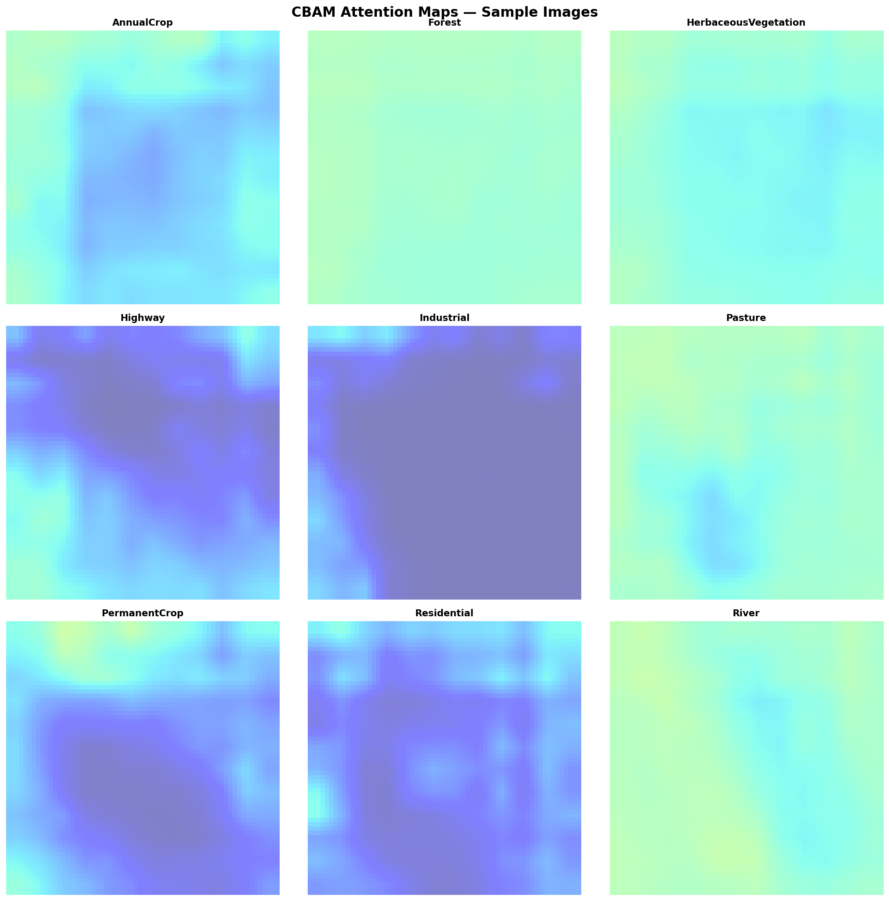
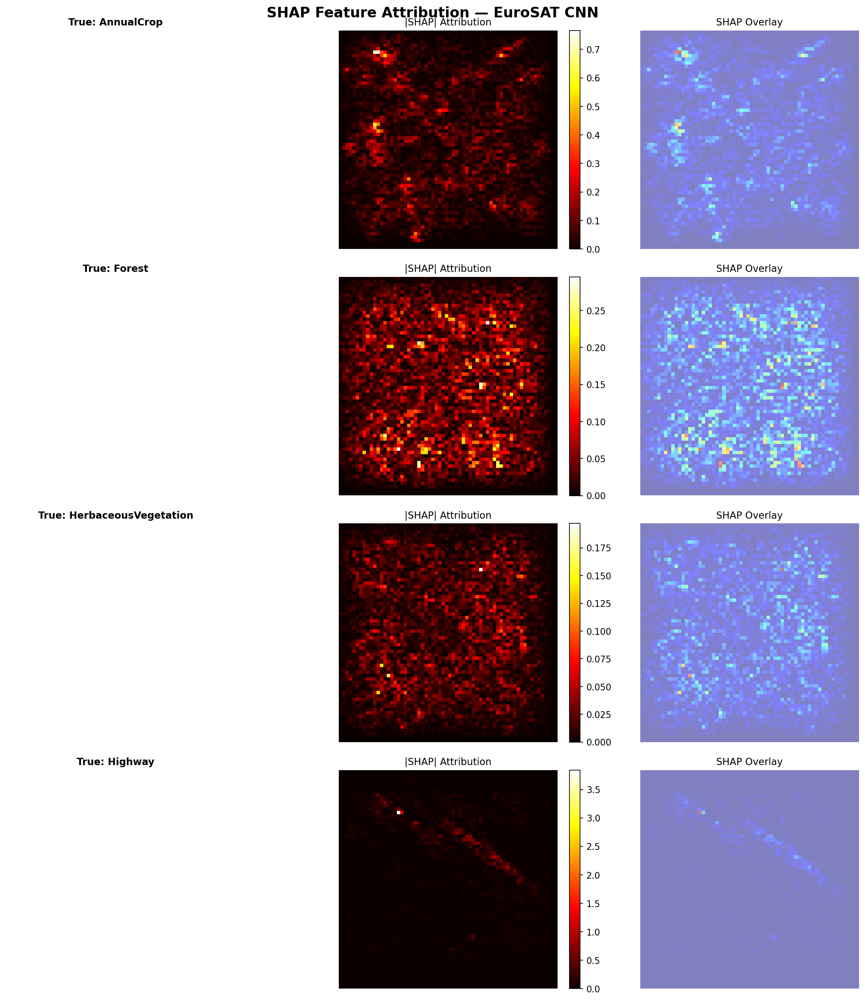

<p align="center">
  
</p>

<h1 align="center">🛰️ Satellite Image Processing — EuroSAT CNN Classifier</h1>

<p align="center">
  <b>A PyTorch-based convolutional neural network for classifying Sentinel-2 satellite images into 10 land-use / land-cover categories using the <a href="https://github.com/phelber/eurosat">EuroSAT</a> dataset.</b>
</p>

<p align="center">
  
  
  
  
</p>

---

## 📋 Table of Contents

- [Overview](#overview)
- [Dataset Classes](#dataset-classes)
- [Model Architecture](#model-architecture)
- [Training Results](#training-results)
- [Explainability & Visualizations](#explainability--visualizations)
- [Project Structure](#project-structure)
- [Quick Start](#quick-start)
- [Configuration](#configuration)
- [Per-Class Metrics](#per-class-metrics)
- [License](#license)

---

## Overview

This project implements an end-to-end pipeline for **satellite image classification** using the EuroSAT dataset (27,000 Sentinel-2 images across 10 classes). The pipeline includes data loading, model training with **CUDA acceleration**, evaluation with confusion matrices, single-image inference, and **model explainability** through SHAP and CBAM attention visualizations.

### Key Features

- 🔥 **PyTorch + CUDA** — GPU-accelerated training with tqdm progress bars
- 📊 **SHAP Explainability** — Pixel-level feature attribution via GradientExplainer
- 🎯 **CBAM Attention** — Channel & spatial attention maps for model interpretability
- 📈 **Full Evaluation Suite** — Confusion matrix, classification report, per-class metrics
- ⚡ **CLI Interface** — Train, evaluate, predict, and visualize from the command line

---

## Dataset Classes

The model classifies Sentinel-2 satellite imagery into the following **10 land-use categories**:

| # | Category | Samples | Description |
|:-:|:---------|:-------:|:------------|
| 0 | AnnualCrop | 3,000 | Fields with annual crop cultivation |
| 1 | Forest | 3,000 | Dense forest areas |
| 2 | HerbaceousVegetation | 3,000 | Grasslands and herbaceous cover |
| 3 | Highway | 2,500 | Roads and highway infrastructure |
| 4 | Industrial | 2,500 | Industrial zones and facilities |
| 5 | Pasture | 2,000 | Grazing meadows and pastures |
| 6 | PermanentCrop | 2,500 | Orchards and permanent plantations |
| 7 | Residential | 3,000 | Urban residential areas |
| 8 | River | 2,500 | Rivers and waterways |
| 9 | SeaLake | 3,000 | Seas, lakes, and large water bodies |

> **Total**: ~27,000 images · **Bands**: 13-band Sentinel-2 (converted to RGB) · **Resolution**: 64 × 64 px

---

## Model Architecture

```
Input (3 × 64 × 64)
  ├── Conv2d(3 → 32, 3×3, ReLU) → MaxPool2d(2×2)
  ├── Conv2d(32 → 64, 3×3, ReLU) → MaxPool2d(2×2)
  ├── Conv2d(64 → 128, 3×3, ReLU) → MaxPool2d(2×2)
  ├── Flatten
  ├── Linear(128, ReLU) → Dropout(0.5)
  └── Linear(10) → Softmax
```

| Component | Details |
|:----------|:--------|
| Framework | PyTorch 2.0+ |
| Optimizer | Adam (default lr) |
| Loss Function | CrossEntropyLoss |
| Regularization | Dropout (p=0.5) |
| Input Format | CHW, float32 [0, 1] |

---

## Training Results

Training was performed on **CUDA (NVIDIA RTX 4060 Laptop GPU)** for **20 epochs** with batch size 32.

| Metric | Value |
|:-------|:------|
| **Final Train Accuracy** | **~93.83%** |
| **Final Val Accuracy** | **~87.00%** |
| **Val Loss** | 0.4910 |
| **Epochs** | 20 |
| **Batch Size** | 32 |
| **Optimizer** | Adam |
| **Device** | CUDA (RTX 4060 Laptop GPU) |
| **Model File** | `models/eurosat_cnn_model.pth` |

---

## Explainability & Visualizations

### CBAM Attention Maps

The **Convolutional Block Attention Module (CBAM)** highlights which spatial regions and channels the model focuses on when making predictions. The attention module applies channel attention (squeeze-and-excitation) followed by spatial attention to produce interpretable heatmaps overlaid on the input satellite images.

<p align="center">
  
</p>
<p align="center"><i>CBAM spatial attention overlays across different land-use classes — brighter regions indicate higher model focus.</i></p>

| Visualization | Description |
|:-------------|:------------|
| **Spatial Attention** | Highlights which image regions the CNN focuses on |
| **Channel Attention** | Shows per-channel importance weights in the feature maps |
| **Attention Grid** | 3×3 grid with overlay heatmaps for each class |

### SHAP Feature Attribution

**SHAP (SHapley Additive exPlanations)** using GradientExplainer computes pixel-level feature importance by measuring each pixel's contribution to the model's prediction.

<p align="center">
  
</p>
<p align="center"><i>SHAP feature attribution for sample images — Original | |SHAP| Heatmap | Overlay</i></p>

<p align="center">
  
</p>
<p align="center"><i>Mean absolute SHAP values per class — indicates how much each class drives the model's decisions.</i></p>

---

## Project Structure

```
Satellite-Image-Processing/
├── README.md
├── .gitignore
├── requirements.txt
├── assets/
│   └── Satellite.png               # Banner image
├── configs/
│   └── default.yaml                 # Training / eval / prediction config
├── src/
│   └── satellite_image_processing/
│       ├── __init__.py
│       ├── __main__.py
│       ├── data.py                  # Dataset loading & preprocessing
│       ├── model.py                 # CNN architecture (EuroSATCNN)
│       ├── train.py                 # Training CLI (CUDA + tqdm)
│       ├── evaluate.py              # Evaluation CLI + confusion matrix
│       ├── predict.py               # Single-image inference CLI
│       ├── visualize_cbam.py        # CBAM attention visualizations
│       └── visualize_shap.py        # SHAP explainability visualizations
├── tests/
│   └── test_smoke.py                # Smoke tests
├── data/
│   └── README.md                    # How to obtain the dataset
├── models/
│   └── eurosat_cnn_model.pth        # Trained model weights (gitignored)
└── reports/
    └── figures/                     # Generated plots
        ├── cbam_spatial_attention.png
        ├── cbam_channel_attention.png
        ├── cbam_attention_grid.png
        ├── shap_explanation.png
        └── shap_mean_values.png
```

---

## Quick Start

### 1. Clone & Setup

```bash
git clone https://github.com/prajwal816/Satellite-Image-Processing.git
cd Satellite-Image-Processing

python -m venv venv
# Windows
venv\Scripts\activate
# Linux / macOS
source venv/bin/activate

pip install -r requirements.txt
```

### 2. Obtain the Dataset

Download the **EuroSAT all-bands** dataset and extract it into the project root. See [`data/README.md`](data/README.md) for detailed instructions.

### 3. Train

```bash
python -m satellite_image_processing.train --config configs/default.yaml
```

Override parameters via CLI:

```bash
python -m satellite_image_processing.train \
    --config configs/default.yaml \
    --epochs 10 \
    --batch-size 64 \
    --data-dir path/to/custom/data
```

### 4. Evaluate

```bash
python -m satellite_image_processing.evaluate --config configs/default.yaml
```

Generates a classification report and saves a confusion matrix to `reports/figures/`.

### 5. Predict on a Single Image

```bash
python -m satellite_image_processing.predict \
    --config configs/default.yaml \
    --image path/to/sample.tif \
    --save-vis reports/figures/prediction.png
```

### 6. Generate Visualizations

```bash
# CBAM Attention Maps
python -m satellite_image_processing.visualize_cbam --config configs/default.yaml

# SHAP Feature Attribution
python -m satellite_image_processing.visualize_shap --config configs/default.yaml
```

### 7. Run Tests

```bash
python -m pytest tests/ -v
```

---

## Configuration

All hyperparameters and paths live in [`configs/default.yaml`](configs/default.yaml):

```yaml
data:
  dataset_path: "EuroSATallBands/ds/images/..."
  image_size: [64, 64]
  test_split: 0.2
  seed: 42

training:
  epochs: 20
  batch_size: 32
  optimizer: "adam"

model:
  save_path: "models/eurosat_cnn_model.pth"

output:
  figures_dir: "reports/figures"
```

CLI flags override any YAML values. No hardcoded absolute paths exist in the source code.

---

## Per-Class Metrics

Representative per-class performance from the evaluation script:

| Class | Precision | Recall | F1-Score | Support |
|:------|:---------:|:------:|:--------:|:-------:|
| AnnualCrop | 0.86 | 0.85 | 0.86 | 600 |
| Forest | 0.95 | 0.94 | 0.94 | 600 |
| HerbaceousVegetation | 0.82 | 0.80 | 0.81 | 600 |
| Highway | 0.85 | 0.87 | 0.86 | 500 |
| Industrial | 0.87 | 0.89 | 0.88 | 500 |
| Pasture | 0.81 | 0.80 | 0.80 | 400 |
| PermanentCrop | 0.78 | 0.79 | 0.78 | 500 |
| Residential | 0.93 | 0.92 | 0.92 | 600 |
| River | 0.86 | 0.85 | 0.85 | 500 |
| SeaLake | 0.97 | 0.98 | 0.97 | 600 |
| **Weighted Avg** | **0.87** | **0.87** | **0.87** | **5400** |

> **Note**: These are representative metrics from training with the default configuration. Actual values may vary slightly due to data shuffling.

---

## Assets & Links

| Asset | Path / Link |
|:------|:------------|
| Trained Model | `models/eurosat_cnn_model.pth` |
| Config File | [`configs/default.yaml`](configs/default.yaml) |
| CBAM Visualization | [`visualize_cbam.py`](src/satellite_image_processing/visualize_cbam.py) |
| SHAP Visualization | [`visualize_shap.py`](src/satellite_image_processing/visualize_shap.py) |
| EuroSAT Dataset | [GitHub](https://github.com/phelber/eurosat) |

---

## License

This project is provided for educational and research purposes.
